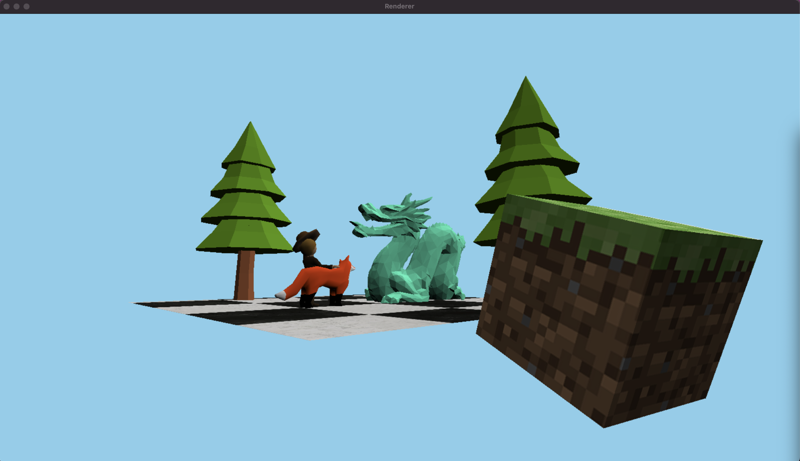

# Rasterizer in C++

This project is a real-time 3D rasterizer implemented in C++. It uses SDL2 for rendering and supports multithreaded rendering, object loading, and texture mapping.

This project is inspired by [Sebastian Lague's 3D Rasterizer](https://www.youtube.com/watch?v=yyJ-hdISgnw) and is designed to be a learning tool for understanding 3D graphics programming.



## Features
- **Real-time rendering**: Render 3D scenes interactively using SDL2.
- **Multithreaded processing**: Efficient rendering using multiple threads.
- **Object loading**: Load `.obj` files with texture and normal data.
- **Texture mapping**: Apply textures to 3D models.
- **Custom math library**: Includes vector operations and transformations.

## Requirements
- C++17 or later
- SDL2 library

## Installation
1. Clone the repository:
    ```bash
    git clone https://github.com/edybostina/rasterizer.git
    cd rasterizer-cpp
    ```
2. Install SDL2:
    ```bash
    brew install sdl2
    ```
3. Build the project:
    ```bash
    make
    ```

## Usage
Run the application:
```bash
./bin/app
```

## File Structure
- **`include/`**: Contains header files for core functionality.
- **`main/`**: Entry point of the application.
- **`bin/`**: Compiled binary output.
- **`objects/`**: Example `.obj` files for rendering.
- **`textures/`**: Texture files for models.

## Example Scene
The default scene includes:
- A cube with grass block texture.
- A fox model.
- A floor with tile texture.
- Trees.
- A guy with a hat (Dave).

## License
This project is licensed under the MIT License. See the [LICENSE](LICENSE) file for details.

## Acknowledgments
- SDL2 for rendering.
- BMP and OBJ file format references.

Enjoy building and experimenting with your own 3D scenes!
